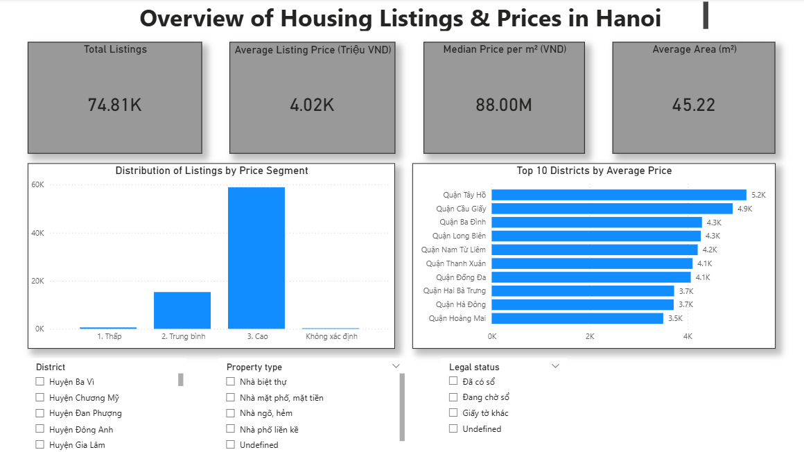
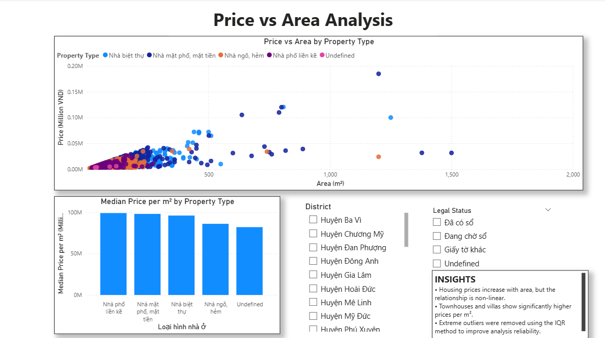
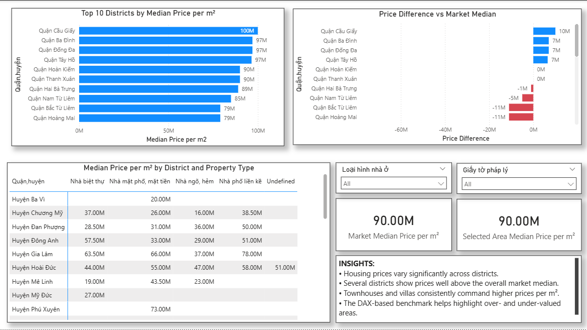

# 🏠 Hanoi Housing Market Analysis: End-to-End Data Pipeline

## 📝 Tổng quan dự án
Dự án này thực hiện phân tích chuyên sâu trên tập dữ liệu **Vietnam Housing Dataset (Hanoi)** với hơn 82,000 bản ghi thô từ Kaggle. Mục tiêu của dự án là xây dựng một quy trình xử lý dữ liệu hoàn chỉnh (End-to-End) bao gồm: Thăm dò dữ liệu (Profiling), Làm sạch (Cleaning), Làm giàu dữ liệu (Enrichment) và Trực quan hóa Dashboard để tìm ra các xu hướng giá bất động sản tại Hà Nội.

## 🛠️ Tech Stack & Công cụ
* **Database:** SQL Server (T-SQL) - Thực hiện toàn bộ quy trình ETL.
* **Visualization:** Power BI - Xây dựng báo cáo phân tích đa chiều.
* **IDE:** DBeaver - Quản trị và thực thi truy vấn.
* **Dataset:** Vietnam Housing Dataset (Kaggle).

## 🏗️ Quy trình xử lý dữ liệu

### 1. Data Profiling (Thăm dò dữ liệu)
Tôi đã thực hiện kịch bản SQL Profiling để xác định các vấn đề về chất lượng dữ liệu:
* **Bất đồng nhất đơn vị:** Cột đơn giá chứa 3 loại đơn vị khác nhau (triệu/m², đ/m², tỷ/m²).
* **Dữ liệu rác:** Phát hiện nhiều giá trị 'NaN' dạng văn bản và các dòng trống (Blank).
* **Lỗi thời gian:** Phát hiện các bản ghi có năm 1900 do lỗi định dạng ngày tháng.
* **Dữ liệu dạng hỗn hợp:** Các cột số tầng, số phòng ngủ bị trộn lẫn chữ và số (ví dụ: "Nhiều hơn 10").

### 2. Data Cleaning (Làm sạch dữ liệu)
Dữ liệu được chuẩn hóa thông qua hệ thống View trong SQL:
* **Chuẩn hóa tiền tệ:** Chuyển đổi toàn bộ các mức đơn giá khác nhau về đơn vị VND duy nhất.
* **Xử lý Missing Values:** Sử dụng `COALESCE` và `NULLIF` để chuyển đổi 'NaN' thành 'Undefined'.
* **Chuẩn hóa kỹ thuật:** Tách bỏ đơn vị đo (m², m) để ép kiểu dữ liệu về dạng số (Numeric) phục vụ tính toán.

### 3. Data Enrichment (Làm giàu dữ liệu)
Tăng cường khả năng phân tích bằng các kỹ thuật thống kê:
* **Xử lý Outliers:** Sử dụng phương pháp **IQR (Interquartile Range)** kết hợp với `PERCENTILE_CONT` để loại bỏ các bất động sản có giá trị "ngáo" hoặc sai lệch.
* **Phân khúc thị trường:** Tạo các "Buckets" để phân loại diện tích và phân khúc giá (Thấp, Trung bình, Cao).
* **Biến thời gian:** Tách YEAR/MONTH từ dữ liệu ngày tháng để phân tích xu hướng theo thời gian.

## 📊 Dashboard Key Insights
Hệ thống Dashboard cung cấp cái nhìn chi tiết về thị trường:

### Trang 1: Tổng quan thị trường

* Thị trường ghi nhận **74.81K tin đăng** với mức giá trung bình **4.02 tỷ VND/căn**.

### Trang 2: Phân tích Giá & Diện tích

* Mối tương quan giữa diện tích và giá là phi tuyến tính; phân khúc **Nhà biệt thự** và **Nhà mặt phố** có đơn giá m² cao vượt trội.

### Trang 3: So sánh khu vực & Benchmark

* Sử dụng DAX để so sánh giá từng khu vực với mức **Median thị trường (90M/m²)**, giúp xác định các vùng đang bị định giá cao.

## 💡 Business Impact
* Tối ưu hóa việc tìm kiếm bất động sản dựa trên các tiêu chí chuẩn hóa về pháp lý và loại hình.
* Cung cấp bộ lọc tin cậy bằng cách loại bỏ hơn 10% dữ liệu sai lệch (outliers) thông qua thuật toán IQR.

---
**Contact Information:**
* **Email:** nguyenphucthinh.work@gmail.com
